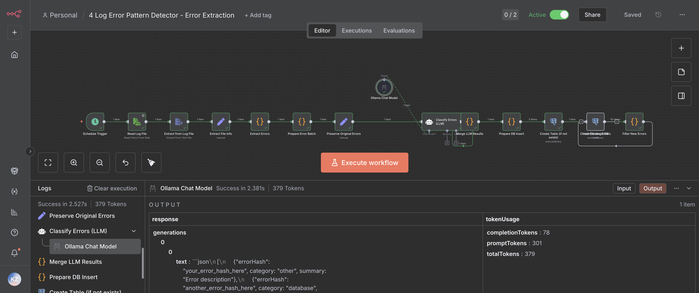
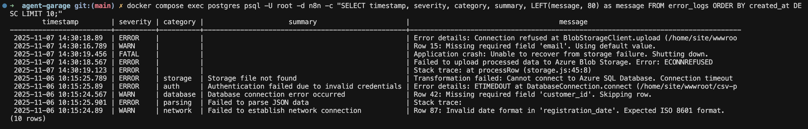

# Log Error Pattern Detector Workflow

## Overview

Automatically analyzes log files, extracts error entries, classifies them using a local LLM (Ollama), and stores results in PostgreSQL for pattern analysis.

**Features:**
- Automatic log analysis on schedule
- Error extraction (ERROR/FATAL/WARN)
- AI classification with category and summary
- PostgreSQL storage with deduplication

## Workflow Flow

```
Schedule Trigger → Read Log File → Extract Errors → Classify Errors (LLM) 
→ Merge LLM Results → Prepare DB Insert → Insert to PostgreSQL
```

### Classify Errors (LLM) Node



## Setup

### Prerequisites

1. **PostgreSQL Credentials** in n8n:
   - Host: `postgres`
   - Database: `n8n`
   - User: `root`
   - Password: `password` (from `.env`)
   - Port: `5432`

2. **Ollama Credentials** in n8n:
   - Base URL: `http://host.docker.internal:11434`
   - Model: `llama3.2:latest`

3. **Log File**: Place at `/data/logs/test.log` in n8n container

### Import & Configure

1. Import workflow:
   ```bash
   ./scripts/update-workflows.sh
   ```

2. Assign credentials:
   - PostgreSQL credential to both PostgreSQL nodes
   - Ollama credential to "Ollama Chat Model" node

## Usage

### Running the Workflow

- **Manual**: Open workflow → Click "Execute Workflow"
- **Scheduled**: Activate workflow → Runs every 5 minutes

### Querying Results

**Using helper script:**
```bash
./scripts/query-errors.sh recent      # View recent errors
./scripts/query-errors.sh count       # Count total errors
./scripts/query-errors.sh by-category # Group by category
```

**Direct SQL:**

Interactive mode:
```bash
docker compose exec postgres psql -U root -d n8n
```

Single command (as shown in screenshot):
```bash
docker compose exec postgres psql -U root -d n8n -c "SELECT timestamp, severity, category, summary, LEFT(message, 80) as message FROM error_logs ORDER BY created_at DESC LIMIT 10;"
```

```sql
-- View recent errors (with truncated message)
SELECT timestamp, severity, category, summary, LEFT(message, 80) as message 
FROM error_logs 
ORDER BY created_at DESC LIMIT 10;

-- Count by category
SELECT category, COUNT(*) as count 
FROM error_logs 
WHERE category IS NOT NULL 
GROUP BY category 
ORDER BY count DESC;
```



## Database Schema

```sql
CREATE TABLE error_logs (
  id UUID PRIMARY KEY DEFAULT gen_random_uuid(),
  timestamp TIMESTAMP,
  source_file TEXT,
  raw_error TEXT,
  error_hash TEXT,
  severity TEXT,
  category TEXT,        -- LLM-classified
  summary TEXT,         -- LLM-generated
  message TEXT,
  created_at TIMESTAMP DEFAULT CURRENT_TIMESTAMP
);
```

**Error Categories:** database, network, storage, auth, parsing, timeout, permission, application, configuration, other

## Verification

### Prerequisites Check

Before testing, verify:
```bash
# Check Docker services
docker compose ps  # Should show n8n, postgres running

# Check log file exists
ls -la logs/test.log
docker exec n8n ls -la /data/logs/test.log

# Check log file has errors
cat logs/test.log | grep -E "\[ERROR\]|\[FATAL\]|\[WARN\]"
```

### Quick Check

1. Execute workflow manually in n8n UI
2. Check key nodes:
   - **Extract Errors**: Should show `errors[]` array with `errorCount > 0`
   - **Merge LLM Results**: Should show `category` and `summary` fields populated
   - **Insert Errors to DB**: Should show rows inserted
3. Verify in database:
   ```bash
   docker compose exec postgres psql -U root -d n8n -c "SELECT COUNT(*) FROM error_logs;"
   ```

### Test Deduplication

1. Run workflow twice (same log file)
2. Error count should NOT double (duplicates skipped)
3. Check "Filter New Errors" node output → Should be empty `[]` on second run

### Test Checklist

- [ ] Docker services running (n8n, postgres)
- [ ] Log file exists and contains `[ERROR]`, `[FATAL]`, or `[WARN]` entries
- [ ] Credentials configured in n8n (PostgreSQL, Ollama)
- [ ] Workflow executes without errors
- [ ] LLM classifications present (`category` and `summary` fields)
- [ ] Errors inserted into database
- [ ] Deduplication works (second run doesn't add duplicates)
- [ ] No NULL values in `category`/`summary` fields

### Quick Test Commands

```bash
# Full test sequence
./scripts/update-workflows.sh                    # Update workflow
./scripts/query-errors.sh count                  # Check initial state
# Run workflow in n8n UI
./scripts/query-errors.sh count                  # Check after first run
# Run workflow again
./scripts/query-errors.sh count                  # Should be same (deduplication)
./scripts/query-errors.sh recent                 # View recent errors
./scripts/query-errors.sh by-category            # View by category
```

## Troubleshooting

| Problem | Solution |
|---------|----------|
| No errors extracted | Verify log file contains `[ERROR]`, `[FATAL]`, or `[WARN]` entries |
| LLM not responding | Check Ollama: `curl http://localhost:11434/api/tags` |
| Database insert fails | Verify PostgreSQL credentials assigned to nodes |
| Empty database | Check "Prepare DB Insert" node output has data |

## Log File Format

Expected format:
```
2025-11-06T10:15:24.567Z [ERROR] Error message here
2025-11-06T10:15:24.890Z [WARN] Warning message here
```

**Requirements:**
- ISO 8601 timestamp at start
- Error level in brackets: `[ERROR]`, `[WARN]`, or `[FATAL]`
- Error message after level

## Requirements Mapping (task.md)

✅ **LLM API call**: `Classify Errors (LLM)` node uses Ollama  
✅ **Traceable input/output**: File input → Database output (queryable)  
✅ **Prompt design**: Constrained prompt requiring exact `errorHash`, category from fixed set, summary  
✅ **Simple SDLC use case**: Log error analysis with AI classification

## Files

- Workflow: `n8n/backup/workflows/4_Log_Error_Pattern_Detector.json`
- Query script: `scripts/query-errors.sh`
