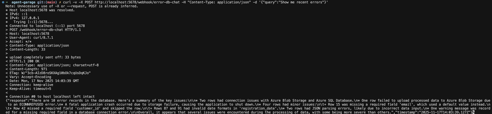
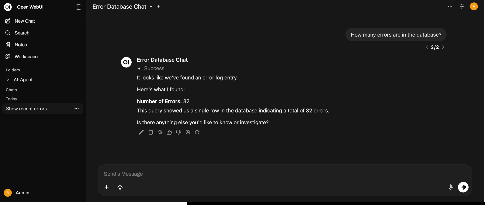

# Error Database Chat Workflow

## Overview

Enables natural language queries to the error database. Converts questions to SQL, executes queries, and returns formatted responses.

**Features:**
- Natural language to SQL conversion (LLM)
- PostgreSQL query execution
- Natural language response formatting (LLM)
- Webhook-based API

## Workflow Flow

```
Webhook Trigger → Parse User Query → Generate SQL Query (LLM) → Extract SQL Query 
→ Execute SQL Query (PostgreSQL) → Format Results → Format Natural Response (LLM) 
→ Extract Response → Webhook Response
```

## Setup

### Prerequisites

1. **PostgreSQL Credentials** in n8n:
   - Host: `postgres`
   - Database: `n8n`
   - User: `root`
   - Password: `password` (from `.env`)
   - Port: `5432`

2. **Ollama Credentials** in n8n:
   - Base URL: `http://host.docker.internal:11434`
   - Model: `llama3.2:latest`

3. **error_logs table** must exist (created by Workflow 4)

### Import & Configure

1. Import workflow:
   ```bash
   ./scripts/update-workflows.sh
   ```

2. Assign credentials:
   - PostgreSQL credential to "Execute SQL Query" node
   - Ollama credential to "Ollama Chat Model" node

3. Get webhook URL:
   - Open workflow in n8n
   - Click "Webhook Trigger" node
   - Copy URL: `http://localhost:5678/webhook/error-db-chat` (from host) or `http://n8n:5678/webhook/error-db-chat` (from containers)

## Usage

### Direct Webhook Testing

```bash
curl -v -X POST http://localhost:5678/webhook/error-db-chat \
  -H "Content-Type: application/json" \
  -d '{"query": "Show me recent errors"}'
```

**Note:** The `-X POST` flag is optional as POST is inferred from the `-d` flag.



### OpenWebUI Integration (Pipe Function)

Add this as a **Pipe** function in OpenWebUI: Settings → Functions → Add Pipe

**Pipe Code**:
```python
from typing import Optional, Callable, Awaitable
from pydantic import BaseModel, Field
import time
import json
import urllib.request

class Pipe:
    class Valves(BaseModel):
        n8n_url: str = Field(
            default="http://n8n:5678/webhook/error-db-chat",
            description="n8n webhook URL (container-to-container)",
        )
        n8n_bearer_token: str = Field(default="", description="Optional Bearer token")
        input_field: str = Field(default="messages", description="Input field name")
        response_field: str = Field(
            default="response", description="Response field name in n8n JSON"
        )
        emit_interval: float = Field(
            default=2.0, description="Status emit interval (seconds)"
        )
        enable_status_indicator: bool = Field(
            default=True, description="Emit status events"
        )

    def __init__(self):
        self.type = "pipe"
        self.id = "error_db_chat_pipe"
        self.name = "Error DB Chat (n8n)"
        self.valves = self.Valves()
        self.last_emit_time = 0

    async def emit_status(
        self,
        __event_emitter__: Callable[[dict], Awaitable[None]],
        level: str,
        message: str,
        done: bool,
    ):
        now = time.time()
        if (
            __event_emitter__
            and self.valves.enable_status_indicator
            and (now - self.last_emit_time >= self.valves.emit_interval or done)
        ):
            await __event_emitter__(
                {
                    "type": "status",
                    "data": {
                        "status": "complete" if done else "in_progress",
                        "level": level,
                        "description": message,
                        "done": done,
                    },
                }
            )
            self.last_emit_time = now

    def _post_json(self, url: str, payload: dict, bearer: str = "") -> dict:
        data = json.dumps(payload).encode("utf-8")
        headers = {"Content-Type": "application/json"}
        if bearer:
            headers["Authorization"] = f"Bearer {bearer}"
        req = urllib.request.Request(url, data=data, headers=headers, method="POST")
        with urllib.request.urlopen(req, timeout=30) as resp:
            return json.loads(resp.read().decode("utf-8"))

    async def pipe(
        self,
        body: dict,
        __user__: Optional[dict] = None,
        __event_emitter__: Callable[[dict], Awaitable[None]] = None,
        __event_call__: Callable[[dict], Awaitable[dict]] = None,
    ) -> Optional[dict]:
        await self.emit_status(
            __event_emitter__, "info", "Calling n8n workflow…", False
        )
        messages = body.get("messages", [])
        if not messages:
            await self.emit_status(
                __event_emitter__, "error", "No messages found", True
            )
            return {"error": "No messages found"}

        # Last user message is the query
        query_text = messages[-1]["content"]
        if "Prompt: " in query_text:
            query_text = query_text.split("Prompt: ")[-1]

        # Build payload for n8n webhook: expects {"query": "..."}
        payload = {"query": query_text}

        # Optional session context
        if __user__ and messages:
            payload["sessionId"] = (
                f"{__user__.get('id','user')} - {messages[0]['content'][:80]}"
            )

        try:
            result = self._post_json(
                self.valves.n8n_url,
                payload,
                self.valves.n8n_bearer_token,
            )
            n8n_response = result.get(
                self.valves.response_field, "No response received"
            )

            # Emit assistant message back to chat
            if __event_emitter__:
                await __event_emitter__(
                    {
                        "type": "message",
                        "data": {"role": "assistant", "content": n8n_response},
                    }
                )
            await self.emit_status(__event_emitter__, "info", "Success", True)
            return {"content": n8n_response}
        except Exception as e:
            msg = f"n8n call failed: {e}"
            if __event_emitter__:
                await self.emit_status(__event_emitter__, "error", msg, True)
            return {"error": msg}
```

**Features:**
- Status indicators during workflow execution
- Automatic message extraction from chat
- Error handling with user feedback
- Configurable webhook URL and response field



## Example Queries

- "Show me recent errors"
- "How many database errors are there?"
- "What are the most common error categories?"
- "Show me all FATAL errors from the last 24 hours"
- "What's the error count by severity?"

## Security

- **Read-Only**: Only SELECT queries allowed
- **SQL Injection Protection**: Dangerous keywords (DROP, DELETE, UPDATE, etc.) blocked
- **Error Handling**: Safe default query if SQL generation fails
- **Timeout**: 30 seconds

## Troubleshooting

| Problem | Solution |
|---------|----------|
| Webhook not responding | Activate workflow in n8n, verify webhook URL |
| SQL generation fails | Check Ollama: `curl http://localhost:11434/api/tags` |
| Database connection fails | Verify PostgreSQL credentials assigned to node |
| Empty response | Check workflow execution logs in n8n UI |
| Ollama connection error | Verify credential URL: `http://host.docker.internal:11434` |

### Quick Diagnostic

```bash
# Test webhook
curl -v -X POST http://localhost:5678/webhook/error-db-chat \
  -H "Content-Type: application/json" \
  -d '{"query": "How many errors?"}'

# Check Ollama
curl http://localhost:11434/api/tags

# Check database
docker compose exec postgres psql -U root -d n8n -c "SELECT COUNT(*) FROM error_logs;"
```

### Common Issues

**Ollama Connection Error (`getaddrinfo ENOTFOUND ollama`)**:
- Fix: Set Ollama credential Base URL to `http://host.docker.internal:11434` (not `http://ollama:11434`)

**SQL Syntax Errors**:
- Already handled by "Extract SQL Query" node (removes quotes, normalizes whitespace)

**Workflow Inactive**:
- Activate workflow in n8n UI for webhook to respond automatically
- Or test manually: Click "Webhook Trigger" node → Execute Node

## Requirements Mapping (task.md)

✅ **LLM API call**: Two LLM calls - SQL generation and response formatting  
✅ **Traceable input/output**: Webhook input → Webhook output (JSON response)  
✅ **Prompt design**: Custom prompts for SQL generation and natural language formatting  
✅ **Simple SDLC use case**: Natural language interface to error log database

## Files

- Workflow: `n8n/backup/workflows/5_Error_Database_Chat.json`

